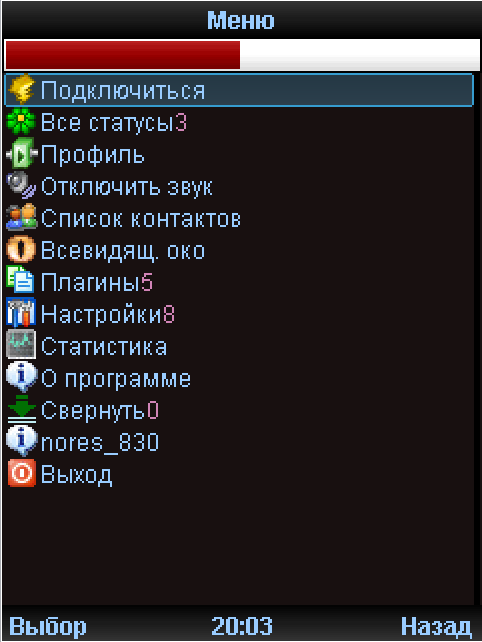
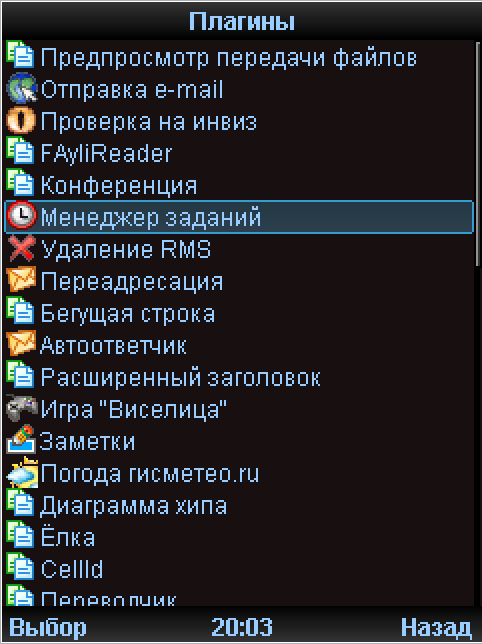
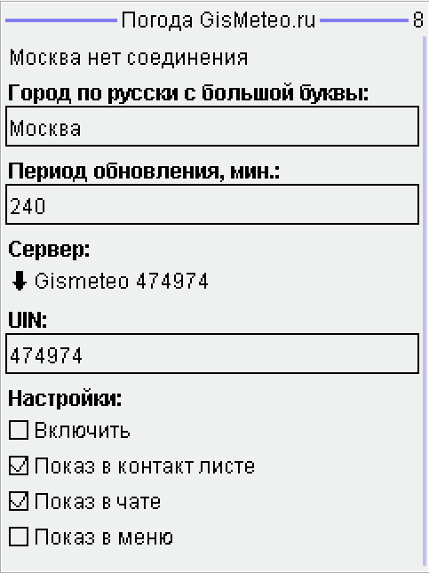
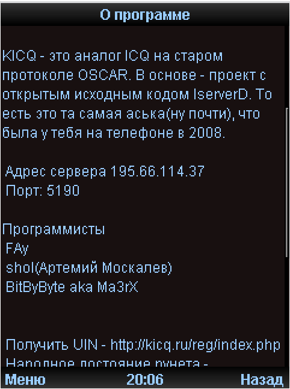
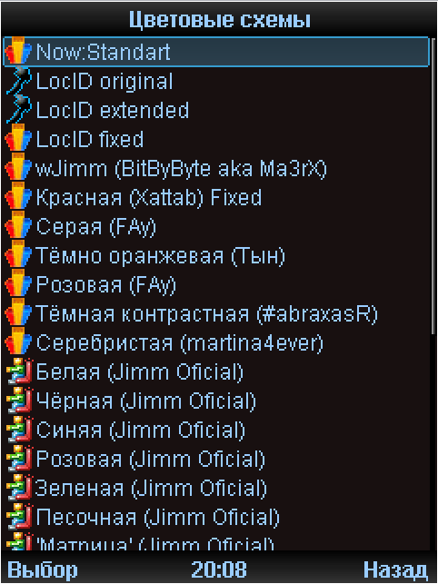
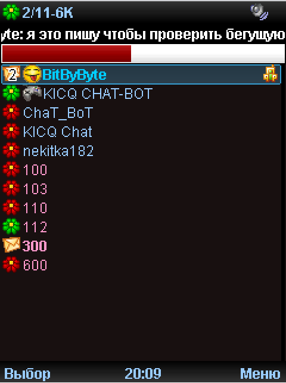
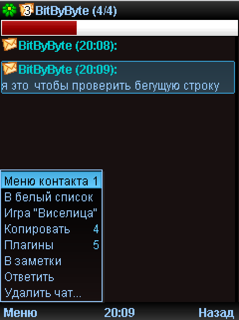

     
    <h1>LocID BitByByteEdition</h1>

Моя сборка **LocID**, с слегка поправленным кодом и исправлениями. Имеет большой список плагинов:

- Предпросмотр передачи файлов
- Отправка e-mail
- Проверка на инвиз
- FAyliReader
- Конференция
- Менеджер задач
- Удаление RMS
- Переадресация
- Бегущая строка
- Автоответчик
- Расширенный заголовок
- Игра "Виселица"
- Заметки
- Погода гисметео.ru
- Диаграмма хипа
- Ёлка
- CellId
- Переводчик
- Персональные настройки
- Мастер цветовой схемы
- Массовая рассылка
- Фоновые часы
- I-Bot валюта
- Игра x-о
- RMS сохранение by Medvedev
- VKontakte
- Бесплатные SMS
- Бесплатные SMS(wapinet)
- Очистка хипа
- Плеер
- Создание list.txt
- Статистика клиентов
- Снежинки
- Opera
- KDPLayer
- StudentsCalc
- SysCalc
- nores_8410

Также есть 112 анимированных смайлов, однако доступна версия с 501 статичным смайлом.

     
    <h1>📷 Скриншоты</h1>

     
    <h1>🌏 Полезные ссылки</h1>

[Последний релиз](https://github.com/ma3rxofficial/bitbybyte-locid/releases/tag/0.1.2)

[KICQ](https://kicq.ru)

[Народное Достояние Рунета](https://narodweb.ru)

     
    <h1>📩 Связь с автором</h1>

[KICQ](https://kicq.ru): **3-739-186**
